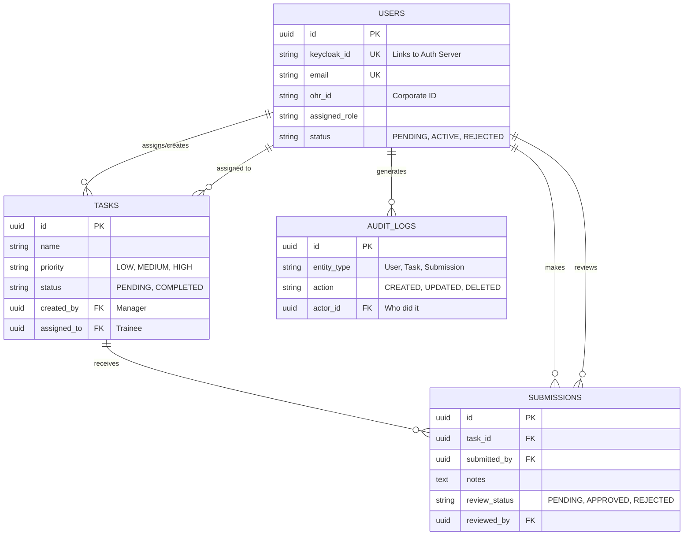
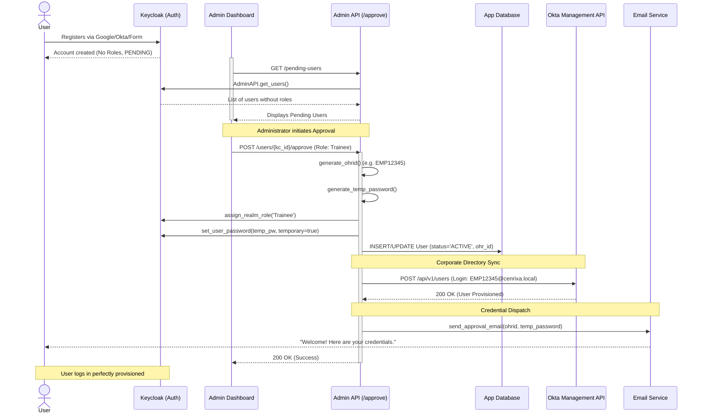
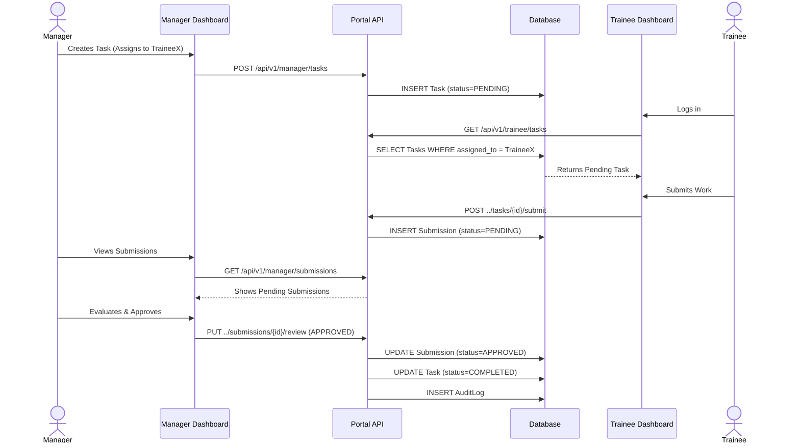

# CENRIXA Training Portal: Comprehensive Technical Documentation (Examiner's Guide)

This document provides an exhaustive, deeply technical walkthrough of the CENRIXA Training Portal. It is designed to explain the "how" and "why" behind every architectural decision, code structure, and business logic workflow. This serves as a definitive guide for evaluating the system's design and implementation.

---

## 1. System Architecture Overview

The CENRIXA Training Portal is built on a modern, decoupled architecture ensuring scalability, security, and maintainability.

```mermaid
graph TD
    subgraph Frontend [Browser (Frontend Dashboards)]
        A[Admin Dashboard]
        M[Manager Dashboard]
        T[Trainee Dashboard]
    end

    subgraph Identity [Identity Provider]
        KC((Keycloak 26.x))
        G[Google IdP] -.->|OIDC| KC
        O[Okta IdP] -.->|SAML/OIDC| KC
    end

    subgraph Backend [FastAPI Backend]
        API[API Routers]
        AuthPkg[keycloak_auth Package]
        RBACPkg[rbac_system Package]
        TaskPkg[taskflow_system Package]
        Email[Email Service]
        OktaSvc[Okta Sync Service]
        
        API --> AuthPkg
        API --> RBACPkg
        API --> TaskPkg
        API --> Email
        API --> OktaSvc
    end

    subgraph Storage [Database Layer]
        DB[(PostgreSQL)]
    end

    Frontend -->|JWT Bearer Token| API
    Frontend -->|Auth Requests| KC
    AuthPkg <-->|JWKS & Admin API| KC
    RBACPkg --> DB
    TaskPkg --> DB
    API --> DB
```

### Architectural Rationale
1.  **Decoupled Frontend/Backend**: Using Vanilla HTML/JS with Express.js as a static server allows the frontend to run completely independent of the FastAPI backend. They communicate strictly via REST APIs secured by JWTs.
2.  **Federated Identity Management**: Delegating authentication entirely to Keycloak. The backend *never* handles user passwords (except during the automated generation phase for new approvals).
3.  **Modular Python Packages**: Instead of a monolithic app structure, core domain logic (`auth`, `rbac`, `taskflow`) is separated into standalone installable Python packages. This allows these components to be versioned, tested, and potentially reused in other internal company projects.

---

## 2. Deep Dive: Core Python Packages

The backend relies on three custom-built Python logic packages.

### A. `keycloak_auth` - Identity & Security Core

This package is responsible for all interactions with Keycloak. It doesn't just validate tokens; it actively manages the Keycloak realm via the Admin API.

**1. Authentication Federation (Google & Okta)**
Keycloak is configured as an "Identity Broker". 
*   **Why?** In a corporate environment, employees might have existing Okta credentials, or contractors might use Google Workspace. Instead of building OAuth flows for each, Keycloak handles them. 
*   **How it works**: The user clicks "Login with Google". Keycloak redirects to Google, validates the response, and then issues its *own* uniform JWT to our application. The backend only ever needs to know how to validate Keycloak tokens, abstracting away the complexity of the upstream IdPs.

**2. JWT Validation Logic (`core.py`)**
Tokens are validated cryptographically using RS256. 
*   **JWKS Caching**: The `TokenValidator` class fetches the public keys from Keycloak's `jwks_uri`. To prevent overwhelming the auth server, it utilizes the `JWKSCache` class to hold the public keys in memory for a configurable TTL (e.g., 600 seconds).
*   **Role Extraction**: The `_extract_roles` method is intelligent enough to look for roles in both `realm_access.roles` and `resource_access.{client_id}.roles`, ensuring compatibility regardless of how Keycloak mappers are configured.

### B. `rbac_system` - Access Control

This package enforces authorization *after* authentication has occurred. 

**Code Insight: The Middleware (`fastapi_utils.py`)**
```python
# Example of the RequireRole dependency
def require_role(allowed_roles: List[str]):
    async def role_checker(
        current_user: AuthenticatedUser = Depends(get_current_user),
        db: AsyncSession = Depends(get_db)
    ):
        # 1. Check JWT claims for roles
        user_roles = current_user.roles
        
        # 2. Check local DB if roles aren't in token (common with some brokered IdPs)
        if not user_roles:
             db_user = await get_user_from_db(db, current_user.user_id)
             user_roles = [db_user.assigned_role]
             
        # 3. Validation
        if not any(role in user_roles for role in allowed_roles):
            raise HTTPException(status_code=403, detail="Insufficient permissions")
            
        return current_user
    return role_checker
```
*   **Why it's needed**: This decorator (`@router.get(..., dependencies=[Depends(require_role(["Admin"]))])`) ensures that endpoint security is declarative and impossible for a developer to accidentally omit.

### C. `taskflow_system` - Business Logic

Handles the core domain logic of the application: training tasks. It abstracts the database operations inside `repository.py` and business rules inside `service.py`.

---

## 3. Database Schema & Entity Relationships

The PostgreSQL database acts as the single source of truth for application state (tasks, statuses, audit logs), while heavily referencing the Identity Provider.



**Key Design Decisions:**
*   **`keycloak_id`**: This is the crucial bridge. The application relies on this UUID to link actions in the portal to the identity verified by Keycloak.
*   **`AuditLog`**: Every significant action (approving a user, grading a task) writes an entry here. This is an enterprise requirement for non-repudiation and tracking.

---

## 4. Workflows & Sequence Diagrams

### A. The Automated User Onboarding Workflow (Extremely Detailed)

This is the most complex flow in the system, handling the transition from a random internet user to a fully provisioned corporate employee.



**Workflow Explanation:**
1.  **Isolation**: Users can register freely, but they sit in a "purgatory" state in Keycloak until an Admin explicitly grants them access. The endpoint `/pending-users` dynamically calculates this by intersecting Keycloak users against local DB active users.
2.  **Corporate Identity**: The creation of the `OHR ID` (Employee ID) is the moment they become official. 
3.  **Cross-System Syncing**: Simultaneously, the system provisions an account in **Okta** via the REST API (`app/services/okta.py`). This anticipates that CENRIXA is just one tool in a wider corporate ecosystem that uses Okta.
4.  **Security Guarantee**: The system sets a temporary password in Keycloak and flags it as `temporary=True`. This native Keycloak feature forces the user to choose a secure password on their very first login screen, ensuring the Admin never knows their actual password.

### B. Task Lifecycle Workflow

The training workflow connects Managers and Trainees.



## 5. UI Integration & Dashboard Logic

The frontend utilizes standard asynchronous JavaScript (`fetch`) to interact with the protected API. 

1.  **Token Bearer Strategy**: When Keycloak authenticates a user, the frontend captures the JWT. Every subsequent `fetch` call attaches this to the `Authorization: Bearer <token>` header.
2.  **State Management**: `localStorage` is used to persist the token across page reloads.
3.  **Role Segregation**:
    *   **`admin.html`**: Contains JavaScript specifically calling `/api/v1/admin/*`. It renders tables for pending approvals and system audit logs. If a Trainee accesses this page, API calls fail with `403 Forbidden` due to the backend `rbac_system`.
    *   **`manager.html`**: Focuses on task CRUD operations and reviewing mechanics. The dropdowns for "Assign To" dynamically call `/manager/trainees` to populate eligible users.
    *   **`trainee.html`**: A focused view parsing the progress (`completion_percentage`) and rendering UI elements (progress bars) dynamically based on backend math.

## 6. Examiner's Summary: Why This Architecture Excels

1.  **Zero-Trust API**: The frontend is treated as untrusted. Every single API route validates the JWT and explicit permissions using decorators.
2.  **Graceful Degradation**: If the `EmailService` fails (e.g., SMTP down), the `/approve` endpoint catches the error, commits the database changes, and returns a 200 OK with a warning flag to the Admin ("Email failed, share manually"), preventing the entire workflow from rolling back over a non-critical side-effect.
3.  **IdP Abstraction**: By putting Keycloak in front of Google and Okta, the application logic remains pristine. If the company switches from Google Workspace to Microsoft Azure AD tomorrow, only Keycloak configuration changes; the Python codebase remains 100% untouched.
