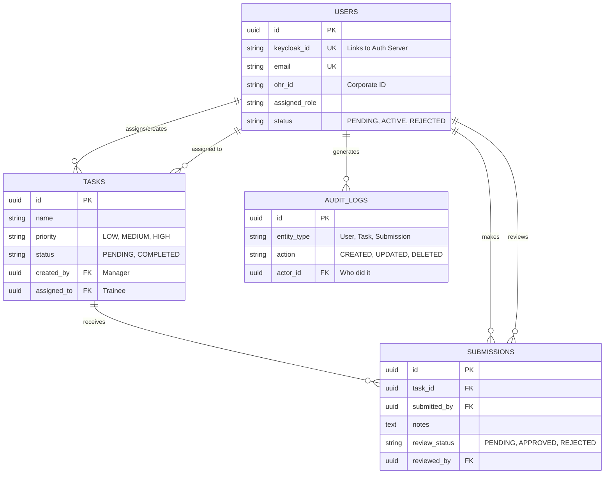
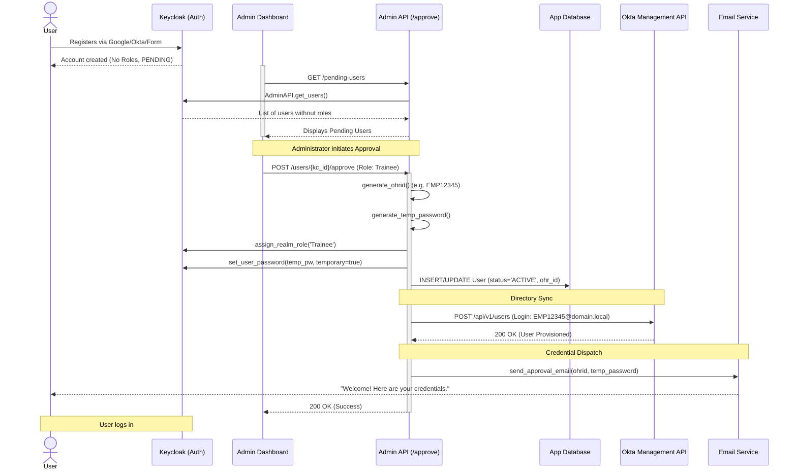
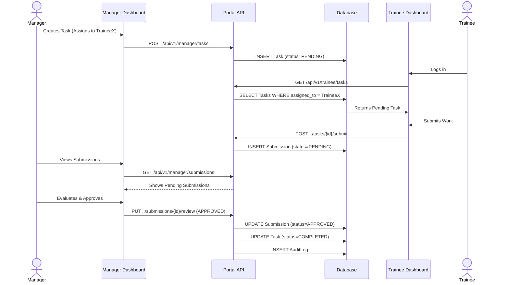

<div align="center">

**[YOUR UNIVERSITY NAME]**
(Established under [Act Details])
[University Address]

Internship Report
on
**‘Architecture and Implementation of a Federated Training Management System’**
Submitted by
**[Your Name]** ([Your USN/Roll Number])
[Jan - May 2026]

Carried under the guidance of
**[Mentor's Name]**, [Company/Institution Name]

</div>

<br><br><br>

<div align="center">
  
**CERTIFICATE**

</div>

This is to certify that the Report entitled **‘Architecture and Implementation of a Federated Training Management System’** is a bonafide work carried out by **[Your Name] ([Your USN/Roll Number])** in partial fulfillment for the completion of 8th semester internship work in the Program of Study [Your Degree], under rules and regulations of [Your University] during the period [Jan- May 2026]. It is certified that all corrections/suggestions indicated for internal assessment have been incorporated in the report.

<br><br><br>
**Signature with date & Seal**  
*Guide / Faculty / Mentor In charge*

<br><br><br>

<div align="center">

**DECLARATION**

</div>

I, **[Your Name]**, hereby declare that the work entitled, **‘Architecture and Implementation of a Federated Training Management System’**, was carried out under the guidance of **[Mentor's Name]** at **[Company/Institution Name]**. This report is being submitted in partial fulfillment of the requirements for completion of 8th Semester course work in the Program of Study, [Your Degree].

**PLACE:** [Your City]  
**DATE:** [Date]  

**NAME AND SIGNATURE OF THE CANDIDATE**

<br><br><br>

### Abstract
The increasing demand for structured employee onboarding and continuous learning in modern organizations requires automated training management systems. Traditional systems often experience fragmented identity management and manual provisioning limitations. 

The objective of this work is to design, implement, and deploy a Training Management System that addresses these operational challenges. The system is built upon a modular architecture utilizing a FastAPI backend, an Express.js-served frontend, and a PostgreSQL database. A primary focus of this project is the integration of federated identity management. The system utilizes Keycloak as an Identity Broker to support Single Sign-On (SSO) via Google and Okta, ensuring a secure centralized authentication process.

The core implementation involves three custom Python packages: `keycloak_auth` for security protocol management, `rbac_system` for granular Role-Based Access Control, and `taskflow_system` for managing the lifecycle of training tasks. A central component of this project is the automated onboarding workflow, which transitions a user from a pending registration to an active employee—automatically generating an Organizational Human Resources ID (OHR ID), syncing credentials with the Okta Management API, and dispatching credential emails.

The results demonstrate an efficient and scalable training platform that reduces administrative overhead while providing role-specific dashboards for Administrators, Managers, and Trainees. This report details the technical implementation of federated authentication, modular software design, and automated provisioning practices.

<br><br><br>

### Acknowledgement
I would like to express my sincere gratitude to **[Company Name]** for providing me with the opportunity to undertake this internship and gain practical experience in full-stack development, identity federation, and system architecture.

I am thankful to my industry mentor, **[Mentor's Name]**, for their guidance, support, and technical feedback throughout the course of this internship. Their expertise in enterprise security and backend engineering was instrumental in designing the system workflows.

I would also like to extend my thanks to my faculty guide, **[Faculty Name]**, for their continued support and motivation during the preparation of this report.

I express my gratitude to the Department of [Your Department], [Your University], for providing the academic resources required to complete this work.

Finally, I would like to thank all those who contributed to the successful completion of this internship project.

<br><br><br>

### Table of Contents
CERTIFICATE  
DECLARATION  
ABSTRACT  
ACKNOWLEDGMENT  
1. INTRODUCTION  
2. SYSTEM ARCHITECTURE OVERVIEW  
3. CORE PYTHON PACKAGES AND LOGIC  
4. DATABASE SCHEMA AND ENTITY RELATIONSHIPS  
5. WORKFLOWS AND SEQUENCE DIAGRAMS  
6. UI INTEGRATION AND DASHBOARD LOGIC  
7. RESULTS AND CONCLUSION  

<br><br><br>

### 1. Introduction
In corporate environments, effective training and onboarding are necessary for operational integration. Organizations frequently manage disjointed systems where user identities must be manually provisioned across different platforms, which can introduce security vulnerabilities and administrative delays.

This Training Management System was developed to address these issues. It is a portal designed to manage the training of employees through automated workflows and centralized identity management. 

#### 1.1 Objectives
1. **Develop a modular backend**: Utilizing FastAPI and standalone Python packages to handle the core application logic.
2. **Implement Federated Authentication**: Integrate Keycloak to act as an Identity Broker, enabling centralized logins via Okta or Google Workspace accounts.
3. **Automate User Provisioning**: Create an automated workflow where administrative approval generates identification (OHR IDs), syncs with external directories (Okta), and emails credentials.
4. **Create Role-Specific Interfaces**: Design frontend dashboards tailored to the operational requirements of Administrators, Managers, and Trainees.

<br><br><br>

### 2. System Architecture Overview
The Training Management System is built on a decoupled architecture prioritizing scalability and security.

```mermaid
graph TD
    subgraph Frontend [Browser (Frontend Dashboards)]
        A[Admin Dashboard]
        M[Manager Dashboard]
        T[Trainee Dashboard]
    end

    subgraph Identity [Identity Provider]
        KC((Keycloak 26.x))
        G[Google IdP] -.->|OIDC| KC
        O[Okta IdP] -.->|SAML/OIDC| KC
    end

    subgraph Backend [FastAPI Backend]
        API[API Routers]
        AuthPkg[keycloak_auth Package]
        RBACPkg[rbac_system Package]
        TaskPkg[taskflow_system Package]
        Email[Email Service]
        OktaSvc[Okta Sync Service]
        
        API --> AuthPkg
        API --> RBACPkg
        API --> TaskPkg
        API --> Email
        API --> OktaSvc
    end

    subgraph Storage [Database Layer]
        DB[(PostgreSQL)]
    end

    Frontend -->|JWT Bearer Token| API
    Frontend -->|Auth Requests| KC
    AuthPkg <-->|JWKS & Admin API| KC
    RBACPkg --> DB
    TaskPkg --> DB
    API --> DB
```

#### 2.1 Design Considerations
1. **Decoupled Frontend/Backend**: Using Vanilla HTML/JS with Express.js as a static server isolates the frontend from the FastAPI backend. They communicate via REST APIs secured by JSON Web Tokens (JWTs).
2. **Federated Identity Management**: Delegating authentication to Keycloak ensures the backend does not process or store user passwords directly, except during the initial generation phase for new approvals.
3. **Modular Python Packages**: Core domain logic (`auth`, `rbac`, `taskflow`) is structured into standalone installable Python packages. This approach supports component versioning and isolated testing.

<br><br><br>

### 3. Core Python Packages and Logic
The backend relies on three custom Python logic packages to manage system operations.

#### 3.1 `keycloak_auth` - Identity & Security Core
This package manages interactions with Keycloak. It validates tokens and manages the Keycloak realm configuration via the Admin API.

**Authentication Federation (Google & Okta)**
Keycloak is configured as an "Identity Broker". In practice, users may utilize existing Okta credentials, or contractors may use Google Workspace. Instead of implementing separate OAuth flows for each provider, Keycloak acts as an intermediary. The user initiates login via Google; Keycloak redirects to Google, validates the response, and then issues its own standardized JWT to the backend application. This abstracts the complexity of upstream identity providers.

**JWT Validation Logic (`core.py`)**
Tokens are cryptographically validated using the RS256 algorithm. 
*   **JWKS Caching**: The `TokenValidator` class retrieves public keys from Keycloak's `jwks_uri`. To optimize network requests, the `JWKSCache` class holds the public keys in memory for a configurable time-to-live (e.g., 600 seconds).
*   **Role Extraction**: The `_extract_roles` method is configured to extract assigned roles from both `realm_access.roles` and `resource_access.{client_id}.roles`, accommodating different Keycloak mapper configurations.

#### 3.2 `rbac_system` - Access Control
This package enforces authorization policies after initial authentication. 

**Middleware Implementation (`fastapi_utils.py`)**
```python
# Example of the RequireRole dependency
def require_role(allowed_roles: List[str]):
    async def role_checker(
        current_user: AuthenticatedUser = Depends(get_current_user),
        db: AsyncSession = Depends(get_db)
    ):
        # 1. Check JWT claims for roles
        user_roles = current_user.roles
        
        # 2. Check local DB if roles aren't in token (common with some brokered IdPs)
        if not user_roles:
             db_user = await get_user_from_db(db, current_user.user_id)
             user_roles = [db_user.assigned_role]
             
        # 3. Validation
        if not any(role in user_roles for role in allowed_roles):
            raise HTTPException(status_code=403, detail="Insufficient permissions")
            
        return current_user
    return role_checker
```
This decorator ensures that endpoint security is explicitly declared at the routing level.

#### 3.3 `taskflow_system` - Business Logic
This package manages the domain logic related to training tasks. It isolates database operations within `repository.py` and enforces business rules within `service.py`.

<br><br><br>

### 4. Database Schema and Entity Relationships
The PostgreSQL database serves as the system of record for application state (tasks, statuses, audit logs) and establishes relational links with the Identity Provider.



**Schema Design Notes:**
*   **`keycloak_id`**: This field acts as the primary link mapping application actions to the identity verified by Keycloak.
*   **`AuditLog`**: System actions (e.g., user approval, task grading) generate an entry in this table to support administrative tracking and audit requirements.

<br><br><br>

### 5. Workflows and Sequence Diagrams

#### 5.1 The Automated User Onboarding Workflow
This workflow manages the transition of an external user to a recognized system entity.



**Workflow Execution:**
1.  **Isolation**: Initial user registrations are held in a pending state within Keycloak until administrative approval is granted. The `/pending-users` endpoint calculates this by correlating Keycloak user records with the local database.
2.  **Identity Generation**: The assignment of the `OHR ID` (Employee ID) formalizes the user's status within the application.
3.  **External Syncing**: The system provisions a parallel account in Okta via the REST API (`app/services/okta.py`), supporting integration with broader corporate environments.
4.  **Credential Management**: A temporary password is set in Keycloak with the `temporary=True` flag. This native feature requires the user to configure a new password upon their first authentication, preventing administrators from accessing persistent credentials.

#### 5.2 Task Lifecycle Workflow
This sequence outlines the interaction model between Managers and Trainees.



<br><br><br>

### 6. UI Integration and Dashboard Logic
The frontend application uses standard asynchronous JavaScript (`fetch`) to communicate with the protected API. 

1.  **Token Bearer Strategy**: Following Keycloak authentication, the frontend stores the JWT. Subsequent `fetch` requests include this token in the `Authorization: Bearer <token>` header.
2.  **State Management**: `localStorage` is utilized to maintain the session token across page navigations.
3.  **Role Segregation**:
    *   **`admin.html`**: Executes JavaScript calls to `/api/v1/admin/*`, rendering tables for pending approvals and audit logs. Access by unauthorized roles results in a `403 Forbidden` response enforced by the backend `rbac_system`.
    *   **`manager.html`**: Facilitates task CRUD operations and review workflows. Data structures, such as assignee dropdowns, are populated via calls to `/manager/trainees`.
    *   **`trainee.html`**: Provides a scoped view for individual progress monitoring, rendering UI elements dynamically based on backend calculations.

<br><br><br>

### 7. Results and Conclusion
The implementation of the Training Management System fulfilled the core technical requirements:
*   **Authentication Infrastructure**: The integration of Keycloak established an SSO capability that processes Google and Okta identities without exposing backend systems to raw credential management.
*   **Workflow Automation**: The automated onboarding sequence formalized user provisioning. The generation of OHR IDs, synchronization with Okta, and email credential dispatch execute automatically upon administrative approval.
*   **Access Control**: The architectural division of frontend interfaces (`admin.html`, `manager.html`, `trainee.html`), supported by the `rbac_system` middleware, maintained strict role boundaries.

This implementation demonstrates the application of decoupled frontends, isolated Python business logic packages, and federated identity management to address workflow automation requirements. The resulting architecture provides a scalable foundation capable of supporting further integration with external systems or the deployment of additional operational features.
